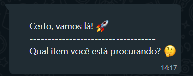
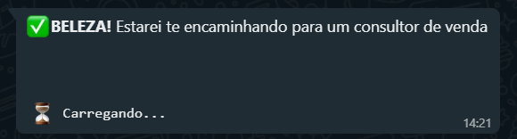
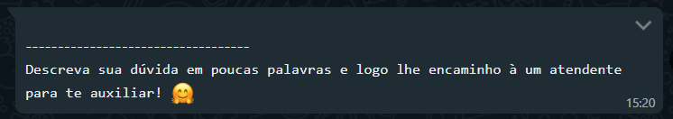

# Whatsapp Bot with VENOM-BOT

## Descrição do Projeto

<p align="center"></p>
<h1 align="center">
    <a href="https://nodejs.org/en/">🔗 NodeJS</a>
    <a href="https://www.npmjs.com/package/venom-bot">🕷 Venom Bot</a>
</h1>
<p align="center"> Projeto criado com o intuito de auxiliar nas demandas de clientes da empresa Vital Equipamentos no WhatsApp.</p>
<br>
<h1 align="center">
  Welcome
  <br>
  
  <br>
  Budget
  <br>
  
  <br>
  Attend
  <br>
  
  <br>
  Talk to seller
  <br>
  
  <br>
  Doubt
  <br>
  
  <br>
</h1>

### Pré-requisitos

Antes de começar, você vai precisar ter instalado em sua máquina as seguintes ferramentas:
[Git](https://git-scm.com), [Node.js](https://nodejs.org/en/).
Além disto, é bom ter um editor para trabalhar com o código como [VSCode](https://code.visualstudio.com/).

### 🎲 Rodando a aplicação

```bash
# Clone este repositório
$ git clone git@github.com:juniorwmr/botwhatsapp-venom.git

# Acesse a pasta do projeto no terminal/cmd
$ cd botwhatsapp-venom

# Instale as dependências
$ npm install

# Execute a aplicação em modo de desenvolvimento
$ yarn dev

## Pronto, escaneie o código QR do Whatsapp e Voilà, aproveite!
```

### 🛠 Tecnologias

As seguintes ferramentas foram usadas na construção do projeto:

- [Node.js](https://nodejs.org/en/)
- [Python](https://www.python.org)

### Autor

---


Done by Lucas Hoepers <3


Thanks to Washington Muniz, this project was based on his project, please consider taking a look at his social media

[](https://twitter.com/juniorwmr) [](https://www.linkedin.com/in/juniorwmr/)
[](mailto:juniorripardo@gmail.com)
