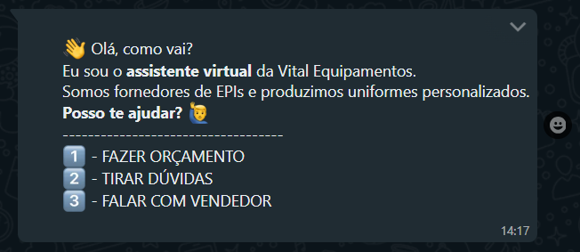
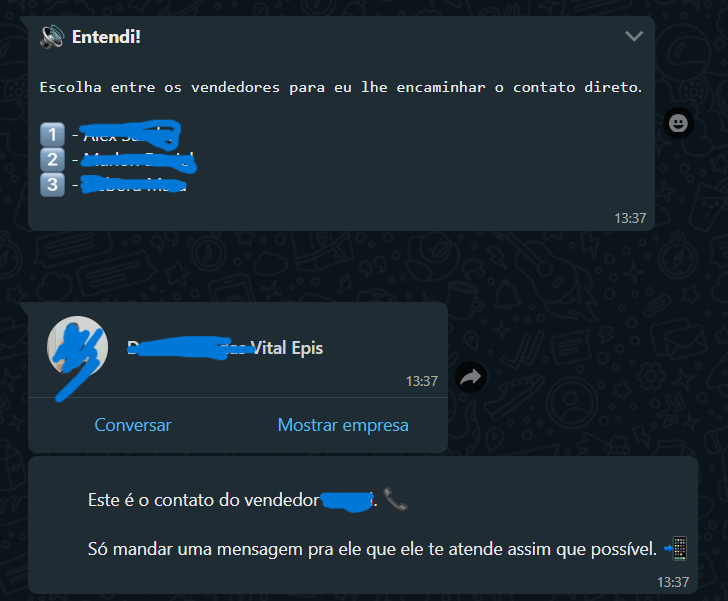

# Whatsapp Bot with VENOM-BOT

## Descrição do Projeto

<h1 align="center">
    <a href="https://nodejs.org/en/">🔗 NodeJS</a>
    <a href="https://www.python.org"> 🐍 Python </a>
    <a href="https://www.npmjs.com/package/venom-bot">🕷 Venom Bot</a>
</h1>

 Projeto criado com o intuito de auxiliar nas demandas de clientes da empresa Vital Equipamentos no WhatsApp.

 
<h1 align="center">
  Welcome
   
  
   
  Budget
   
  
   
  Attend
   
  
   
  Talk to seller
   
  
   
  Doubt
   
  
   
</h1>
### 🛠 Tecnologias

As seguintes ferramentas foram usadas na construção do projeto:

- [Node.js](https://nodejs.org/en/)
- [Python](https://www.python.org)

<h1>Como preparar o programa para execução 😎:</h1>

Primeiramente, terá de clonar este repositório:

<h4><i>gh repo clone LucasQuinaglia/BotVenom-Vital</i></h4>

Logo após, terá de instalar as dependências do programa

<h4><i>npm i</i></h4>

E é pra estar tudo certo, para um melhor desfruto das funcionalidades,
recomendo ser usado: 

<h4><i>node ./server.js</i> </h4>

Para ser usado, terá de definir o diretório para a pasta src 👾:

<h4><i>cd C:/onde/se/encontra/seu/repositorio/src</i></h4>

Mas caso prefira, pode ser usado:

<h4><i>npm run dev</i></h4>

(usei principalmente o "node ./server.js", pelo fato de com o "npm run dev"
ele reiniciar o bot toda vez que o data.json era reescrito com as informações
do cliente 🤡)

### Autor

---

Done by Lucas Hoepers <3🫡

Thanks to Washington Muniz, this project was based on his project, please consider taking a look at his social media

